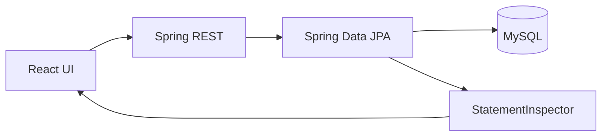

# Project Overview

## Concept
RelatioLab anedi practical JPA relationship lab. Telugu lo cheppali ante: "entity madhya bandham ni code + SQL level lo choodadam".

## Visual


## Code Snippet
```java
@GetMapping("/api/v1/debug/sql/recent")
public List<SqlTraceResponse> recentSql(...) { ... }
```
Annotation: backend SQL traces ni UI ki expose chestundi.

## Common Mistakes
1. H2 lo test ???? MySQL edge cases miss avvadam.
2. Entity ni direct response ga return cheyadam.
3. N+1 ni detect cheyakunda performance slow avvadam.

## Interview Talking Points
- "I can demonstrate all 4 mappings with SQL proof."
- "I compare JOIN FETCH vs EntityGraph vs Batch with query counts."

## Related Files
- `backend/src/main/java/com/relatiolab/RelatioLabApplication.java`
- `backend/src/main/java/com/relatiolab/controller/DebugController.java`
- `frontend/src/pages/SqlMonitorPage.tsx`