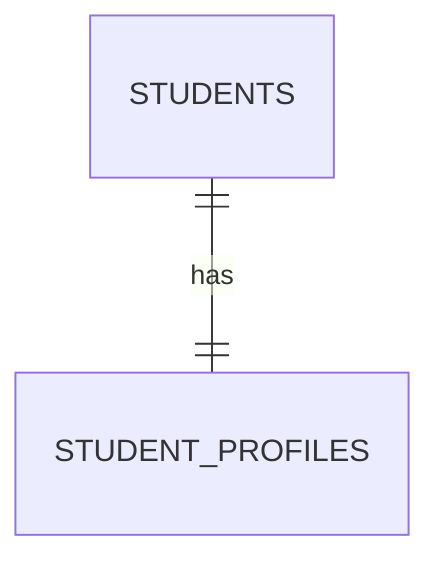

# OneToOne Explained

## Concept
One student ki one profile. FK `student_profiles.student_id` lo untundi.

## Visual


## Code Snippet
```java
@OneToOne(fetch = FetchType.LAZY)
@JoinColumn(name = "student_id", nullable = false, unique = true)
private Student student;
```
Annotation: owning side `StudentProfile`.

## Common Mistakes
1. Both entities lo `@JoinColumn` pettadam.
2. `unique=true` miss avvadam.
3. orphanRemoval expectation unna set null cheyakapovadam.

## Interview Talking Points
- "Owning side controls FK update."
- "orphanRemoval=true means parent nundi detach ayina child DB lo delete." 

## Related Files
- `backend/src/main/java/com/relatiolab/entity/Student.java`
- `backend/src/main/java/com/relatiolab/entity/StudentProfile.java`
- `backend/src/main/java/com/relatiolab/service/StudentService.java`