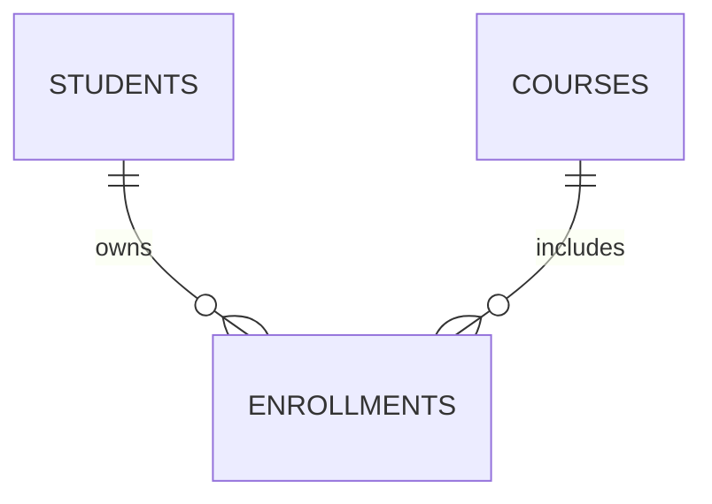

# OneToMany and ManyToOne Explained

## Concept
Student ki multiple enrollments untayi. Enrollment side lo FK columns (`student_id`, `course_id`) untayi.

## Visual


## Code Snippet
```java
@ManyToOne(fetch = FetchType.LAZY)
@JoinColumn(name = "student_id", nullable = false)
private Student student;
```
Annotation: child side owning side.

## Common Mistakes
1. Parent collection add chesi child parent set cheyakapovadam.
2. Nullable FK accidentally allow cheyadam.
3. Unique(student_id, course_id) miss avvadam.

## Interview Talking Points
- "ManyToOne is typically owning side with FK."
- "OneToMany generally inverse side via mappedBy."

## Related Files
- `backend/src/main/java/com/relatiolab/entity/Enrollment.java`
- `backend/src/main/java/com/relatiolab/entity/Student.java`
- `backend/src/main/java/com/relatiolab/service/EnrollmentService.java`