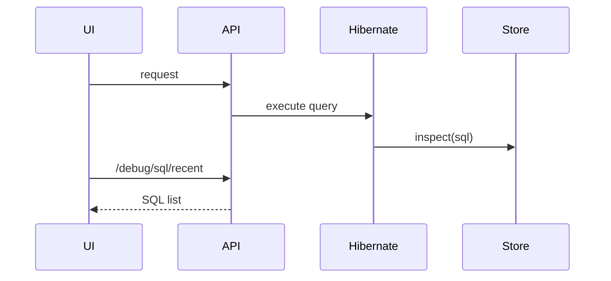

# SQL Visualization Setup

## Concept
Hibernate generate chese SQL ni StatementInspector capture ???? UI lo live ga choodachu.

## Visual


## Code Snippet
```java
public String inspect(String sql) {
    sqlTraceStore.add(SqlTraceEntry.builder().sql(sql).operation(op).build());
    return sql;
}
```
Annotation: SQL modify cheyyakunda trace only ?????????.

## Common Mistakes
1. request correlation id track cheyakapovadam.
2. unbounded memory list maintain cheyyadam.
3. production lo sensitive SQL masking ??????? expose ???????.

## Interview Talking Points
- "We captured SQL with StatementInspector, not log scraping."
- "Per-request SQL diagnostics used for fetch tuning."

## Related Files
- `backend/src/main/java/com/relatiolab/debug/HibernateSqlInspector.java`
- `backend/src/main/java/com/relatiolab/debug/RequestTraceFilter.java`
- `frontend/src/pages/SqlMonitorPage.tsx`