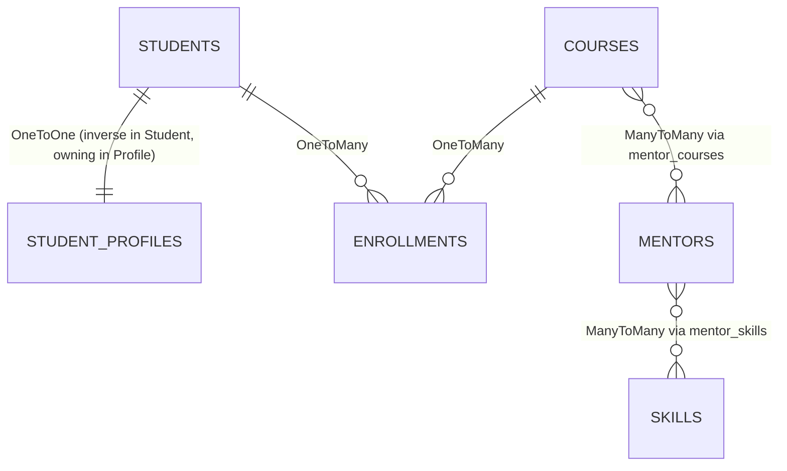

# RelatioLab LLD - Entity Connections

## ER Relationship Map

## Ownership + FK/Join Control

| Relationship | Owning Side (DB control) | Inverse Side | Physical FK / Join Table |
|---|---|---|---|
| Student <-> StudentProfile | `StudentProfile.student` | `Student.profile` | `student_profiles.student_id` |
| Student <-> Enrollment | `Enrollment.student` | `Student.enrollments` | `enrollments.student_id` |
| Course <-> Enrollment | `Enrollment.course` | `Course.enrollments` | `enrollments.course_id` |
| Course <-> Mentor | `Course.mentors` | `Mentor.courses` | `mentor_courses(course_id, mentor_id)` |
| Mentor <-> Skill | `Mentor.skills` | `Skill.mentors` | `mentor_skills(mentor_id, skill_id)` |

## Aggregate/Lifecycle Decisions

- `Student -> StudentProfile`: `cascade=ALL`, `orphanRemoval=true`
- `Student -> Enrollment`: `cascade=ALL`, `orphanRemoval=true`
- `Course -> Enrollment`: `cascade=ALL`, `orphanRemoval=true`
- `Course <-> Mentor`: no cascade remove (shared entity safety)
- `Mentor <-> Skill`: `PERSIST`, `MERGE` only

## Unique/Integrity Constraints

- `students.email` unique
- `skills.code` unique
- `student_profiles.student_id` unique (strict 1:1)
- `enrollments (student_id, course_id)` unique

## Source Files

- `relatiolab/backend/src/main/java/com/relatiolab/entity/Student.java`
- `relatiolab/backend/src/main/java/com/relatiolab/entity/StudentProfile.java`
- `relatiolab/backend/src/main/java/com/relatiolab/entity/Enrollment.java`
- `relatiolab/backend/src/main/java/com/relatiolab/entity/Course.java`
- `relatiolab/backend/src/main/java/com/relatiolab/entity/Mentor.java`
- `relatiolab/backend/src/main/java/com/relatiolab/entity/Skill.java`